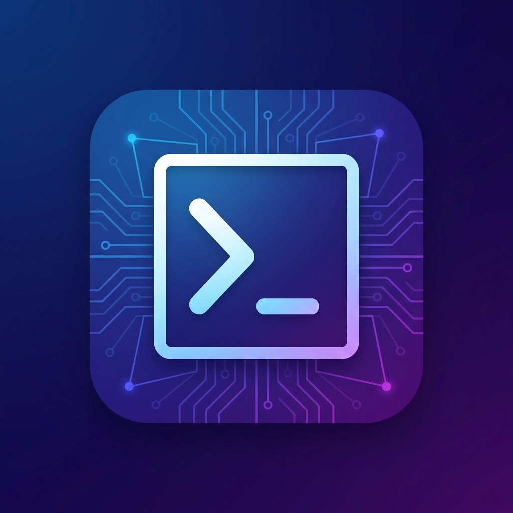
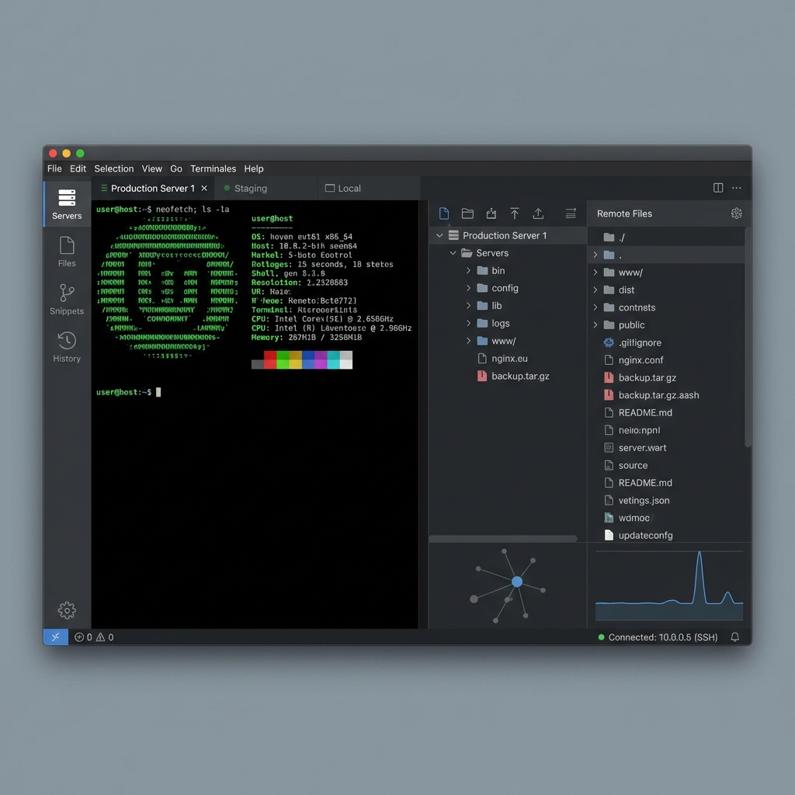

# OpenMoba Term 🚀

<div align="center">
  
  
  <h3>The Ultimate Multi-Protocol Session Manager</h3>
  <p>
    Connect to everything. Manage everywhere.
    <br />
    <a href="#-downloads"><strong>Download Now »</strong></a>
    <br />
    <br />
    <a href="https://github.com/AgustinBouzonn/open-moba-term/issues/new?template=bug_report.md">Report Bug</a>
    ·
    <a href="https://github.com/AgustinBouzonn/open-moba-term/issues/new?template=feature_request.md">Request Feature</a>
  </p>
</div>

<div align="center">

[](LICENSE)
[](https://github.com/AgustinBouzonn/open-moba-term/releases/latest)
[](https://github.com/AgustinBouzonn/open-moba-term/releases)
[](https://www.electronjs.org/)

</div>

---

## 📖 About OpenMoba

**OpenMoba** is a modern, open-source terminal and remote desktop manager designed for system administrators, developers, and DevOps engineers.

Unlike other tools that are bloated or expensive, OpenMoba offers a clean, high-performance interface to manage all your remote connections in one place. Whether you are managing a Linux server via SSH, transferring files via SFTP, fixing a Windows server via RDP, or helping a user via VNC, OpenMoba has you covered.

### ✨ Key Features

- **🖥️ Multi-Protocol Support**:
  - **SSH**: Full-featured terminal with xterm.js (colors, copy/paste, resizing).
  - **SFTP**: Built-in file manager with drag-and-drop upload/download.
  - **RDP**: Connect to Windows servers with Remote Desktop Protocol (using `node-rdpjs`).
  - **VNC**: Remote desktop viewing for Linux/Mac/Windows (using `rfb2`).

- **📑 Tabbed Interface**: Manage dozens of connections simultaneously with a sleek, chrome-like tab system.
- **🔒 Secure by Design**: Credentials are encrypted using your OS's native keychain (Windows Credential Manager, macOS Keychain, libsecret).
- **🎨 Modern UI**: Dark mode, beautiful typography, and responsive design powered by React.
- **⚡ High Performance**: Built with Vite and Electron 28 for instant startup and low latency.

---

## 📸 Screenshots

<div align="center">
  
  <p><em>Manage SSH, RDP, and VNC sessions in a single, unified interface.</em></p>
</div>

---

## 📥 Downloads

OpenMoba is available for Windows, macOS, and Linux.

| Platform    | Download                                                                                     | Format               |
| ----------- | -------------------------------------------------------------------------------------------- | -------------------- |
| **Windows** | [**Download Latest .exe**](https://github.com/AgustinBouzonn/open-moba-term/releases/latest) | Installer / Portable |
| **Linux**   | [**Download .AppImage**](https://github.com/AgustinBouzonn/open-moba-term/releases/latest)   | AppImage / Deb       |
| **macOS**   | [**Download .dmg**](https://github.com/AgustinBouzonn/open-moba-term/releases/latest)        | Disk Image           |

### ⚡ Installation

#### Windows

1. Download the `.exe` installer.
2. Run it (SmartScreen might warn you as it is unsigned, click "Run Anyway").
3. Launch from Desktop or Start Menu.

#### Linux

```bash
chmod +x OpenMoba-1.0.0.AppImage
./OpenMoba-1.0.0.AppImage
```

---

## 🛠️ Development Setup

Prerequisites:

- Node.js 18+
- Git

```bash
# 1. Clone the repository
git clone https://github.com/AgustinBouzonn/open-moba-term.git
cd open-moba-term

# 2. Install dependencies (and apply patches)
npm install

# 3. Start development server
npm run dev
```

### Build from Source

```bash
# Build for your current OS
npm run build

# Build for specific platform (requires admin on Windows for .exe)
npm run build:win
npm run build:linux
npm run build:mac
```

---

## 🏗️ Architecture

OpenMoba uses a secure, multi-process architecture:

- **Main Process**: Electron core, window management, secure storage (keytar).
- **Renderer**: React UI, state management (Zustand), xterm.js components.
- **Worker Threads**: Heavy protocols (SSH, RDP, VNC) run in separate Node.js worker threads to ensure the UI never freezes.
- **IPC**: Communication via `MessageChannel` for low-latency data transfer.

---

## 🤝 Contributing

Contributions are welcome! Please check our [Contribution Guidelines](CONTRIBUTING.md).

1. Fork the Project
2. Create your Feature Branch (`git checkout -b feature/AmazingFeature`)
3. Commit your Changes (`git commit -m 'feat: Add some amazing feature'`)
4. Push to the Branch (`git push origin feature/AmazingFeature`)
5. Open a Pull Request

---

## ⚖️ License

Distributed under the **GPL-3.0 License**. See [LICENSE](LICENSE) for more information.

---

## 🙏 Acknowledgements

- **xterm.js** - For the amazing terminal component.
- **ssh2** - For the SSH client implementation.
- **node-rdpjs** - For RDP protocol support.
- **rfb2** - For VNC protocol support.
- **Electron** - For making desktop development accessible.

<div align="center">
  <sub>Built with ❤️ by Agustin</sub>
</div>
